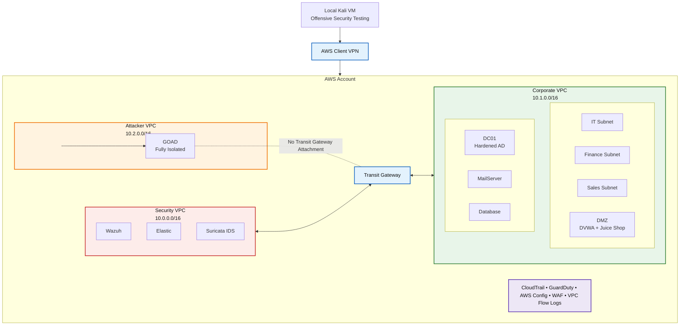

# aws-soc-homelab
Production-grade SOC home lab on AWS with SIEM, hardened AD, network IDS, hybrid identity. (In progress)

#Summary

A production style Security Operations Center built from scratch on AWS, spanning both defense and offense: a segmented multi-VPC network, a four tool SIEM/IDS detection stack, a CIS hardened Active Directory domain, a WAF protected application tier, an isolated offensive lab (GOAD), and adversary emulation tooling (Atomic Red Team, Caldera) driving documented purple team attack and detect scenarios mapped to MITRE ATT&CK.

# STATUS: ACTIVELY BUILDING. 

This is a living project - I'm documenting it as I build, including the real problems I hit and how I solved them. The build log in `build-notes/` reflects genuine troubleshooting, not a polished tutorial. Sections marked "planned" are next on the roadmap.

# Why I built this

To learn/practice core cybersecurity concepts in offensive/defensive/cloud security operations end to end: network design, SIEM engineering, detection writing, AD hardening, and the offensive techniques those defenses are meant to stop. I learn fastest by building real systems and debugging real failures, and this repo is the evidence of that process. The same skills can be trasfered to other cloud vendors (Azure/GCP) and tools (Sentinel, Splunk, Defender), which I'm confident I can pick up quickly.

# Architecture

Three isolated VPCs connected by a Transit Gateway, with an attacker VPC deliberately left unattached for isolation.

See `architecture/` for the full diagram and design decisions.

# Build status

| 			Area 	   		    |   Status 	        |              Notes 	           |
|---------------------------------------------------|-------------------|----------------------------------|
| AWS account hardening (MFA, IAM, CLI via SSO)     | ✅ Done 		| 	       ---	           |
| Logging baseline (CloudTrail, GuardDuty, Config)  | ✅ Done 		| CIS conformance pack 	           |
| Multi-VPC network + Transit Gateway 		    | ✅ Done 		| Attacker VPC isolated by design  |
| Security groups (least privilege, egress filtered)| ✅ Done 		| 7 tiered SGs 		           |
| Hardened Active Directory (DC01) 		    | ✅ Done 		| CIS baseline — see `docs/`  	   |
| Windows endpoints domain joined 		    | ✅ Done 		| 3 endpoints, tiered OUs          |
| Wazuh SIEM + agents 			            | ✅ Done 		| Custom detection rules           |
| Elastic Stack + Logstash pipelines 		    | ✅ Done 		| CloudTrail + VPC Flow Logs 	   |
| Suricata network IDS + VPC traffic mirroring      | ✅ Done 		| Alerts forwarded to Wazuh 	   |
| Vulnerable web apps (DVWA, Juice Shop) 	    | 🔶 In progress    | 	       --- 		   |
| Finance DB + mail server 			    | 📋 Planned 	| 	       ---		   |
| AWS Client VPN 				    | 📋 Planned 	|              ---	           |
| Hybrid identity (Entra ID + Okta) 		    | 📋 Planned	|              ---	           |
| GOAD offensive lab (isolated VPC)		    | 📋 Planned 	|  	       --- 		   |
| AWS WAF on application load balancer              | 📋 Planned        | Rules + rate limiting + logging  |
| Adversary emulation - Atomic Red Team             | 📋 Planned        | Atomic tests per MITRE technique |
| Adversary emulation - Caldera                     | 📋 Planned        | Automated attack chains          |
| Purple team scenarios (MITRE ATT&CK mapped)       | 📋 Planned        | Attack -> detect -> harden       |
| Lambda cost scheduler			            | 📋 Planned 	|              --- 		   |
| Documented attack/detection scenarios 	    | 📋 Planned 	|   	       ---		   |
| Terraform IaC					    | 📋 Planned        | Capturing working config as I go |				   |

# Skills demonstrated

- Cloud architecture: multi-VPC segmentation, Transit Gateway routing, NAT/IGW design, least-privilege security groups with egress filtering.

- SIEM engineering: Wazuh deployment + custom rules, Elastic/Logstash ingestion pipelines for AWS log sources, multi-tool correlation.

- Network detection: Suricata IDS with ET Open ruleset, VPC traffic mirroring (VXLAN), alert forwarding into a central SIEM (Wazuh).

- Active Directory security: CIS hardening - Protected Users, AES-only Kerberos, NTLMv1/SMBv1 disabled, LLMNR/NetBIOS off, tiered admin model, LAPS, full audit + PowerShell logging, fine-grained password policies.

- Cloud security posture: CloudTrail, GuardDuty, AWS Config with CIS conformance pack.

- Linux/Windows administration, troubleshooting, and secure by default configuration.

- Offensive & Purple-team: adversary emulation with Atomic Red Team and Caldera, attacks against an isolated GOAD lab (Kerberoasting, AS-REP roasting, DCSync, NTLM relay, Golden Ticket, password spraying, web exploitation), each mapped to MITRE ATT&CK and paired with the detection that catches it and the hardening that stops it.

# Tech stack

AWS (VPC, EC2, TGW, IAM, CloudTrail, GuardDuty, Config, S3, WAF, AWS CLI);
 Wazuh 4.14;
  Elastic Stack 9.4;
   Suricata 8.0;
    Atomic Red Team; 
     Caldera;
      MITRE ATT&CK; 
       GOAD;
        Windows Server 2022 (Active Directory + Endpoints);
         Ubuntu 24.04 (SIEM + Company Apps);
          Kali Linux (attack scenarios);
           Terraform;
            GitHub

# Engineering challenges solved

Real problems hit during the build (full detail in `build-notes/`):

- AD domain-join failures: "ERROR_NO_SUCH_DOMAIN" -> traced to the DC locator needing CLDAP over UDP 389, which the security group didn't allow; TCP 389 alone is insufficient.

- VPC DNS design: a domain controller must point DNS at itself and use a forwarder (to the AWS resolver) for external resolution; the VPC DHCP option set must be applied before launching members.

- Logstash ingestion: resolved plugin/Gemfile conflicts, TLS cert permissions, cross-index contamination, and CloudTrail field-mapping errors to get clean AWS log ingestion.

- VPC traffic mirroring: mirrored traffic arrives as VXLAN on UDP 4789 and requires an explicit security-group rule on the monitor interface.

- Tooling pivots: switched the network IDS from Security Onion (now Oracle Linux only) to standalone Suricata when the platform requirements changed.

# Repository structure

| Directory | Contents |
|-----------|----------|
| `architecture/` | network diagram + design decisions |
| `build-notes/` | phase-by-phase build log with troubleshooting |
| `detections/` | `wazuh-rules/`, `suricata/`, `logstash-pipelines/` |
| `docs/` | deep-dives (AD hardening, etc.) |
| `runbooks/` | incident-response procedures |
| `screenshots/` | evidence of working components |

# Roadmap

Web apps + DB → WAF on ALB → Client VPN → hybrid identity → GOAD offensive lab → adversary emulation (Atomic Red Team, Caldera) → documented purple-team scenarios → full Terraform IaC.

-----------------------------------------------------------------------------------------------------------

*Built and maintained by DH. Notes reflect an active, in-progress learning project.*
